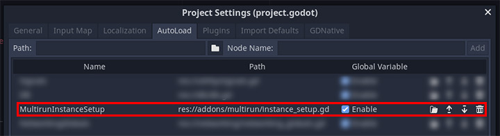
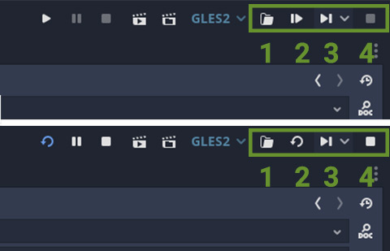
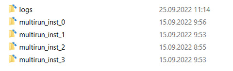
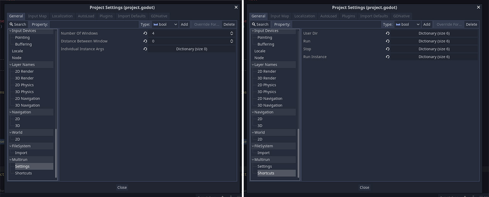

# Multirun

Multirun allows starting multiple game instances at once.

The main purpose of this feature is to speed up multiplayer game development. One game instance can be configured to host the game and others to join.

Tested on Godot v3.5

## Installation

This plugin is installed the same way as other Godot plugins.

Download the code by clicking green `Code` button and then `Download ZIP`. Unpack it anywhere you like.

Copy the folder `addons/dreadpon.spatial_gardener/` to `res://addons/` in your Godot project and enable it from `Project -> Project Settings -> Plugins`.

**NOTE:** this plugin relies on an autoload singleton `res://addons/multirun/instance_setup.gd` under the name of `MultirunInstanceSetup` to run.
If your windows aren't positioning themselves correctly, check if `MultirunInstanceSetup` is properly loaded.

## How to use

Launching game instances can be done via buttons in the top right corner of Godot editor.
- 1 - open `user://` directory
- 2 - run all instances (or *re*launch if already launched)
- 3 - run a specific instance (will honor it's window positioning and custom `user://` directory)
- 4 - stop all running instances

This plugin also supports personal subfolders for each instance ran. They are meant to be used instead of a regular `user://` path.

A personal path can be accessed via singleton `MultirunInstanceSetup.instance_user_dir` or `MultirunInstanceSetup.get_user_path()`. When launched standalone, this path will refer to `user://` as usual and only change when you are, indeed, "multirunning" your game.

## Settings

You can configure the following settings in the `Project -> Project Settings -> Multirun`:
- `Number Of Windows` to run
- `Distance Between Windows` if you need extra space betwenen them. **NOTE:** there's some space between them by default: Windows OS includes "active zones" (for manually changing window size) when calculating window bounds
- `Individual Instance Args` - console arguments to pass to each instance as dictionary of instace indices as keys and string of arguments as values. **NOTE:** to pass the same args to ALL instances use the key of `-1`
- Key `Shortcuts` for actions defined in paragraph 1

## Additional Information

Finding problems in the code, open a ticket on [GitHub](https://github.com/perfoon/Multirun/issues).

**NOTE:** it might take some time to merge v.2.0.0 to main, in which case Dreadpon should be tagged for their resolution.

